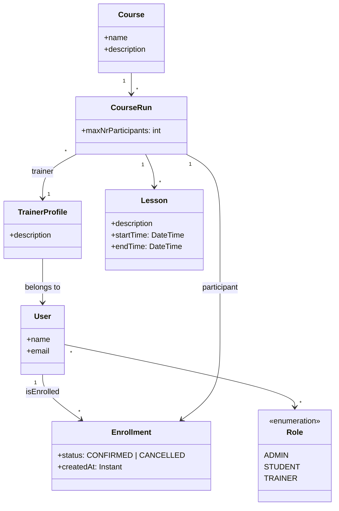

## Class Diagram of the Domain

```mermaid  
classDiagram
    class Role {
        <<enumeration>>
        ADMIN
        STUDENT
        TRAINER
    }

    class User {
        +name
        +email
    }

    class TrainerProfile {
        +description
    }

    class Enrollment {
        +status: CONFIRMED | CANCELLED
        +createdAt: Instant
    }

    class Course {
        +name
        +description
    }

    class CourseRun {
        +maxNrParticipants: int
    }

    class Lesson {
        +description
        +startTime: DateTime
        +endTime: DateTime
    }

%% Relationships
    Course "1" --> "*" CourseRun
    CourseRun "1" --> "*" Lesson
    User "*" --> "*" Role
    TrainerProfile --> User : belongs to
    User "1" --> "*" Enrollment : isEnrolled
    CourseRun "1" --> "*" Enrollment : participant
    CourseRun "*" --> "1" TrainerProfile : trainer
```